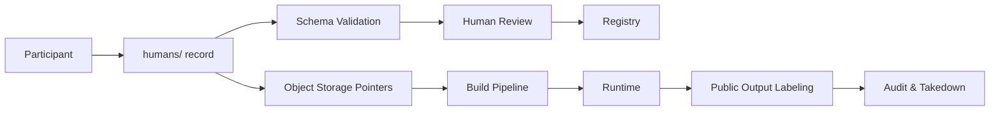

# Architecture

## Detailed Diagrams

- [Repository Structure](diagrams/repository-structure.md) — directory layout for records, schemas, and tools
- [Data Flow](diagrams/data-flow.md) — authoring pipeline and 5-stage runtime assembly
- [Consent & Withdrawal](diagrams/consent-withdrawal.md) — consent evidence requirements and withdrawal lifecycle
- [Privacy Boundaries](diagrams/privacy-boundaries.md) — sensitivity levels and storage boundaries
