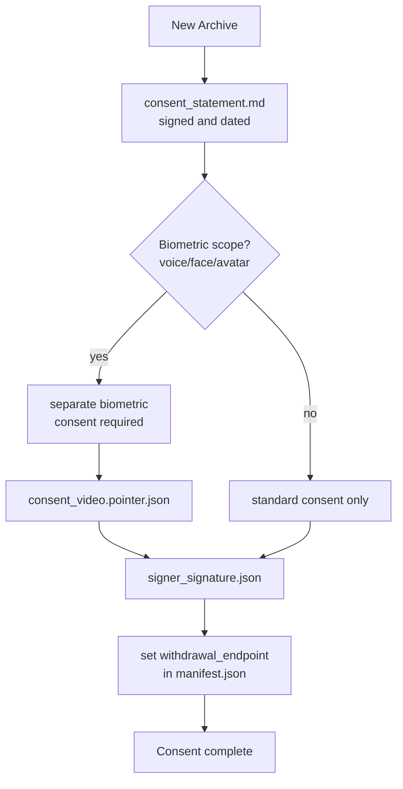
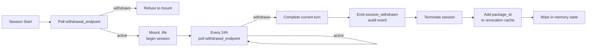

# Consent and Withdrawal Process

## Consent Evidence Requirements

```mermaid
flowchart TD
    A[New Archive] --> B[consent_statement.md\nsigned and dated]
    B --> C{Biometric scope?\nvoice/face/avatar}
    C -->|yes| D[separate biometric\nconsent required]
    C -->|no| E[standard consent only]
    D --> F[consent_video.pointer.json]
    F --> G[signer_signature.json]
    E --> G
    G --> H[set withdrawal_endpoint\nin manifest.json]
    H --> I[Consent complete]
```

## Withdrawal Lifecycle

```mermaid
flowchart LR
    A[Session Start] --> B[Poll withdrawal_endpoint]
    B -->|withdrawn| C[Refuse to mount]
    B -->|active| D[Mount .life\nbegin session]
    D --> E[Every 24h\npoll withdrawal_endpoint]
    E -->|active| E
    E -->|withdrawn| F[Complete current turn]
    F --> G[Emit session_withdrawn\naudit event]
    G --> H[Terminate session]
    H --> I[Add package_id\nto revocation cache]
    I --> J[Wipe in-memory state]
```
