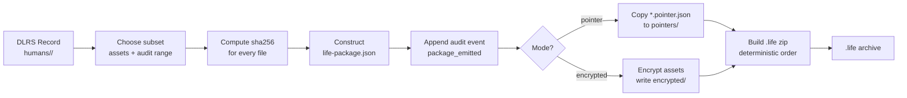
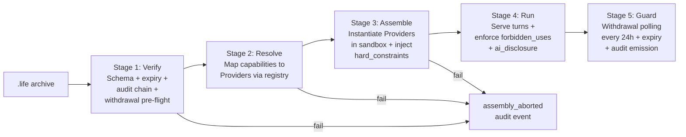

# DLRS Data Flow

## Authoring Pipeline (DLRS Record → `.life` package)

```mermaid
flowchart LR
    A[DLRS Record\nhumans/<id>/] --> B[Choose subset\nassets + audit range]
    B --> C[Compute sha256\nfor every file]
    C --> D[Construct\nlife-package.json]
    D --> E[Append audit event\npackage_emitted]
    E --> F{Mode?}
    F -->|pointer| G[Copy *.pointer.json\nto pointers/]
    F -->|encrypted| H[Encrypt assets\nwrite encrypted/]
    G --> I[Build .life zip\ndeterministic order]
    H --> I
    I --> J[.life archive]
```

## Runtime Assembly Pipeline (5-Stage)

```mermaid
flowchart LR
    J[.life archive] --> S1
    S1["Stage 1: Verify\nSchema + expiry +\naudit chain +\nwithdrawal pre-flight"] --> S2
    S2["Stage 2: Resolve\nMap capabilities to\nProviders via registry"] --> S3
    S3["Stage 3: Assemble\nInstantiate Providers\nin sandbox + inject\nhard_constraints"] --> S4
    S4["Stage 4: Run\nServe turns +\nenforce forbidden_uses\n+ ai_disclosure"] --> S5
    S5["Stage 5: Guard\nWithdrawal polling\nevery 24h + expiry\n+ audit emission"]

    S1 -->|fail| ABORT[assembly_aborted\naudit event]
    S2 -->|fail| ABORT
    S3 -->|fail| ABORT
```
