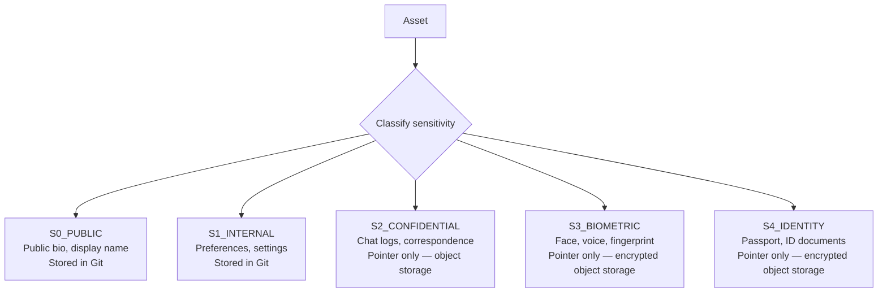
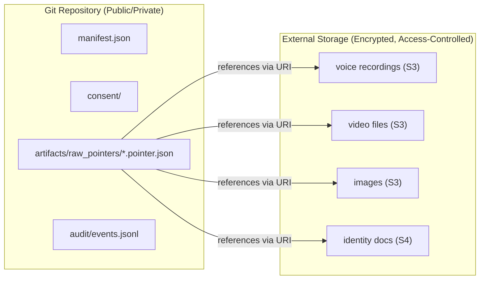

# Privacy Boundaries and Sensitivity Levels

## Sensitivity Level Classification

```mermaid
flowchart TD
    A[Asset] --> B{Classify sensitivity}
    B --> S0["S0_PUBLIC\nPublic bio, display name\nStored in Git"]
    B --> S1["S1_INTERNAL\nPreferences, settings\nStored in Git"]
    B --> S2["S2_CONFIDENTIAL\nChat logs, correspondence\nPointer only — object storage"]
    B --> S3["S3_BIOMETRIC\nFace, voice, fingerprint\nPointer only — encrypted object storage"]
    B --> S4["S4_IDENTITY\nPassport, ID documents\nPointer only — encrypted object storage"]
```

## Storage Boundary

```mermaid
flowchart LR
    subgraph Git ["Git Repository (Public/Private)"]
        M[manifest.json]
        C[consent/]
        P["artifacts/raw_pointers/*.pointer.json"]
        AU[audit/events.jsonl]
    end

    subgraph Ext ["External Storage (Encrypted, Access-Controlled)"]
        V["voice recordings (S3)"]
        VID["video files (S3)"]
        IMG["images (S3)"]
        ID["identity docs (S4)"]
    end

    P -->|references via URI| V
    P -->|references via URI| VID
    P -->|references via URI| IMG
    P -->|references via URI| ID
```
