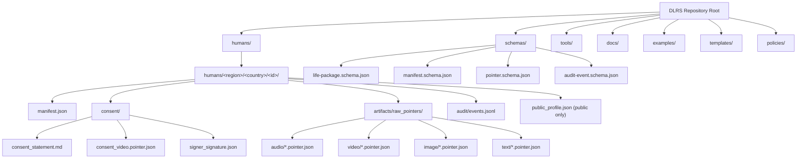

# DLRS Repository Structure

```mermaid
flowchart TD
    Root[DLRS Repository Root]

    Root --> humans/
    Root --> schemas/
    Root --> tools/
    Root --> docs/
    Root --> examples/
    Root --> templates/
    Root --> policies/

    humans/ --> record["humans/&lt;region&gt;/&lt;country&gt;/&lt;id&gt;/"]
    record --> manifest["manifest.json"]
    record --> consent["consent/"]
    record --> artifacts["artifacts/raw_pointers/"]
    record --> audit["audit/events.jsonl"]
    record --> profile["public_profile.json (public only)"]

    artifacts --> audio["audio/*.pointer.json"]
    artifacts --> video["video/*.pointer.json"]
    artifacts --> image["image/*.pointer.json"]
    artifacts --> text["text/*.pointer.json"]

    consent --> statement["consent_statement.md"]
    consent --> video_ptr["consent_video.pointer.json"]
    consent --> sig["signer_signature.json"]

    schemas/ --> life["life-package.schema.json"]
    schemas/ --> mani["manifest.schema.json"]
    schemas/ --> ptr["pointer.schema.json"]
    schemas/ --> audit_s["audit-event.schema.json"]
```
